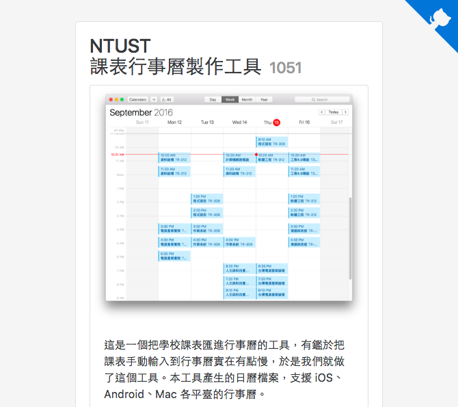

# 課程行事曆產生工具

[](https://travis-ci.org/Yukaii/ics-scheduler)



一個把學校課表轉成 ics 格式(iCalendar, [RFC 5545](https://tools.ietf.org/html/rfc5545)) 的工具 :heart:。

改寫自 Neson 有四年歷史（！）的專案 [NTUST-ics-Class-Schedule](https://github.com/Neson/NTUST-ics-Class-Schedule)，為了用 GitHub Pages 免費部屬，由原本的 PHP 架構改用客端 JavaScript 重新寫過。去掉資料庫，取而代之是[純粹 JSON 檔案](https://github.com/Yukaii/ics-scheduler/tree/gh-pages)的資料儲存。

前端使用 Bootstrap v4 alpha 以及 jQuery 3。雖然已經 2016，不過做架構簡單的東西，這樣就夠了 :sweat_smile:

目前支援 NTUST。

## Development

請確定已安裝 [Node.js](https://nodejs.org)。

本專案採用 [brunch](http://brunch.io) 作為建置工具，總之設定檔比 webpack 少寫很多 :laughing:

```bash
npm install
npm install brunch -g
brunch watch --server
```

### Build for production

```bash
brunch build --production
```

## Deployment

本專案使用 Travis CI 做 Continous Deployment，自動部屬到 GitHub Pages 上，可以參考 [PR#2](https://github.com/Yukaii/ics-scheduler/pull/2)。

## Contribution

see Wiki [Contribution Guide](https://github.com/Yukaii/ics-scheduler/wiki/Contribution)

## License

MIT License

Copyright (c) 2016 Yukai Huang

Permission is hereby granted, free of charge, to any person obtaining a copy
of this software and associated documentation files (the "Software"), to deal
in the Software without restriction, including without limitation the rights
to use, copy, modify, merge, publish, distribute, sublicense, and/or sell
copies of the Software, and to permit persons to whom the Software is
furnished to do so, subject to the following conditions:

The above copyright notice and this permission notice shall be included in all
copies or substantial portions of the Software.

THE SOFTWARE IS PROVIDED "AS IS", WITHOUT WARRANTY OF ANY KIND, EXPRESS OR
IMPLIED, INCLUDING BUT NOT LIMITED TO THE WARRANTIES OF MERCHANTABILITY,
FITNESS FOR A PARTICULAR PURPOSE AND NONINFRINGEMENT. IN NO EVENT SHALL THE
AUTHORS OR COPYRIGHT HOLDERS BE LIABLE FOR ANY CLAIM, DAMAGES OR OTHER
LIABILITY, WHETHER IN AN ACTION OF CONTRACT, TORT OR OTHERWISE, ARISING FROM,
OUT OF OR IN CONNECTION WITH THE SOFTWARE OR THE USE OR OTHER DEALINGS IN THE
SOFTWARE.
